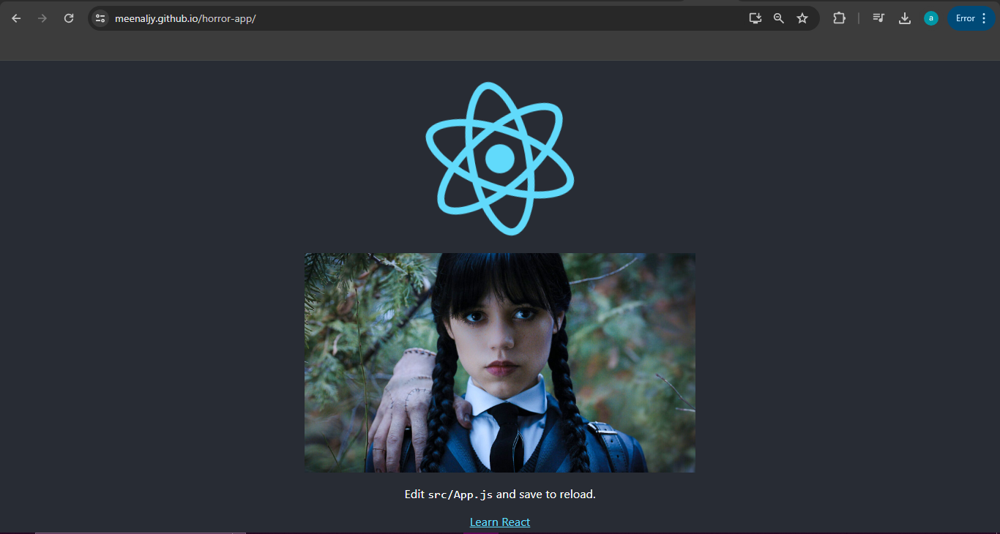

# Horror App🎃👻🥶 

This repository demonstrates how to deploy a React app using GitHub Pages. GitHub Pages is a static site hosting service that takes HTML, CSS, and JavaScript files straight from a repository on GitHub, optionally runs the files through a build process, and publishes a website.

## Table of Contents
- [What is GitHub Pages](#what-is-github-pages)
- [Create and Deploy a React App](#create-and-deploy-a-react-app)
  - [Creating a React App](#creating-a-react-app)
  - [Steps to Deploy a React App to GitHub Pages](#steps-to-deploy-a-react-app-to-github-pages)
- [Repository Settings](#repository-settings)
  - [Settings Configuration](#settings-configuration)

## What is GitHub Pages

GitHub Pages is a service provided by GitHub to host static websites directly from a repository. It supports custom domains, HTTPS, and can run the files through a build process before deployment.

## Create and Deploy a React App

### Creating a React App

1. **Install Node.js and npm**: Make sure you have Node.js and npm installed on your computer.
2. **Create a React App**: Use Create React App to set up your project.
   ```bash
   npx create-react-app horror-app
   cd horror-app
   ```

### Steps to Deploy a React App to GitHub Pages

1. **Install gh-pages**: Install the `gh-pages` package as a dev dependency.
   ```bash
   npm install gh-pages --save-dev
   ```
2. **Add homepage to package.json**: Add the following line to your `package.json` file.
   ```json
   "homepage": "https://<your-username>.github.io/horror-app"
   ```
3. **Add deploy scripts to package.json**: Add the following scripts to the `scripts` section of your `package.json`.
   ```json
   "scripts": {
     "predeploy": "npm run build",
     "deploy": "gh-pages -d build"
   }
   ```
4. **Initialize a Git repository** (if you haven't already):
   ```bash
   git init
   git remote add origin https://github.com/<your-username>/horror-app.git
   git add .
   git commit -m "Initial commit"
   git push -u origin master
   ```
5. **Deploy your app**:
   ```bash
   npm run deploy
   ```

## Repository Settings

### Settings Configuration

1. **Navigate to the repository settings**: Go to your repository on GitHub, click on the `Settings` tab.
2. **GitHub Pages settings**:
   - Under the `Pages` section, ensure the source is set to the `gh-pages` branch.
   - Save the settings.

Your React app should now be live at `https://<your-username>.github.io/horror-app`.


